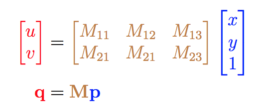
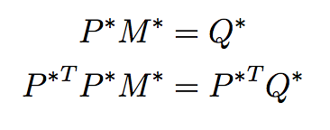

## imagealign

In this application, I apply my recently implemented [Cholesky factorization](https://github.com/kevinzakka/linalg/tree/master/cholesky) to solve the image alignment problem.

Specifically, the goal is to compute the affine transformation matrix `M` that relates the crooked image coordinate system to that of the reference image.

<p align="center">
 
</p>

## API

Put the reference image and the crooked image inside `./imgs/`. Make sure to prefix the crooked image with `crooked_` and run the following command:

```
python align.py
```

## Algorithm

Suppose A is the reference image (left) and B is the crooked image (right). Our assumption is that there is a certain affine transformation relating `(u, v)` coordinates in A and `(x, y)` coordinates in B. Concretely, using homogeneous coordinates, we can represent the transformation as a matrix multiplication of the form

<p align="center">
 
</p>

To solve for M, I ask the user to select at least 6 points in A that match points in B. We oversample the minimum number of points required to minimize the error and produce a more stable estimate. As such, our column vectors p and q become:

<p align="center">
 
</p>

and thus, our goal is to solve the linear system of equations `Q = MP`. The problem is that we are used to solving systems of the form `Ax = b`, where `x` is the unknown. In our case, we are trying to solve the system `xA = b`. There are two ways to solve this. 

We could just take the transpose on both sides but doing so would result in A not being symmetric positive definite meaning I can't apply the Cholesky factorization.

Thus, a workaround to this is to flatten `M` and `Q` as column vectors, rearrange `P` in a clever manner, and remark the following:

<p align="center">
 
</p>

Since this is in standard form, we obtain the solution as follows:

<p align="center">
 
</p>

and we can apply Cholesky factorization to solve for `M`.

## Result

<p align="center">
 
</p>
